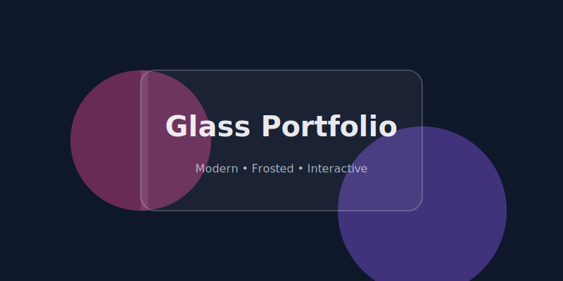

<div align="center">
  

  # Glass Portfolio

  **Build a stunning, frosted-glass personal site in minutes.**

  [](https://opensource.org/licenses/MIT)
  [](https://reactjs.org/)
  [](https://tailwindcss.com/)
  
  [**View Live Demo**](https://bdarbe.github.io/glass-portfolio/) • [**Read the Guide**](#-how-i-built-this)

</div>

---

## ⚡ The "Why"
I was tired of generic portfolio templates that looked like 2015. I wanted something that felt **alive**—smooth animations, modern aesthetics, and high performance.

**Glass Portfolio** is the result. It's not just a template; it's a deep dive into modern CSS aesthetics and React animation orchestration.

<div align="center">
  
</div>

## ⚡ The "Why"

I built this project to explore **Glassmorphism** in a performant way. Here are the key technical takeaways for developers:

### 1. The "Frosted Glass" Effect
The core visual style relies on the CSS `backdrop-filter` property. To ensure it looks good on dark backgrounds, we use a semi-transparent white layer with a blur.

```css
/* The Secret Sauce */
.glass-panel {
  background: rgba(255, 255, 255, 0.1); /* 10% Opacity */
  backdrop-filter: blur(16px);          /* The Frost */
  border: 1px solid rgba(255, 255, 255, 0.2);
}
```

### 2. Fluid Backgrounds
Static backgrounds are boring. I used pure CSS animations (`@keyframes`) to move colored "blobs" behind the glass panel. Because the glass blurs them, it creates a shifting, aurora-like effect without heavy WebGL libraries.

### 3. Orchestrated Motion
I used **Framer Motion** to handle the entrance animations. The key is `staggerChildren`—loading elements one by one creates a sense of polish that instant loading lacks.

---

## 🎨 How to Make It Yours

This repo is designed to be forked. You don't need to touch the complex code.

1.  Open `src/App.jsx`.
2.  Edit the `CONFIG` object at the top:

```javascript
const CONFIG = {
  name: "Ben",
  role: "Creative Developer",
  projects: [ ... ] // Add your own!
};
```
3.  Deploy!

## 📦 Installation & Setup

```bash
# 1. Clone
git clone https://github.com/bdarbe/glass-portfolio.git

# 2. Install
cd glass-portfolio
npm install

# 3. Run
npm run dev
```

## 🤝 Contributing
Got an idea to make it cooler? Open a PR! I'm actively looking for:
- [ ] Dark/Light mode toggle
- [ ] More blob animation patterns
- [ ] Mobile-specific optimizations

---

<div align="center">
  <p>Star ⭐ this repo if you found it useful!</p>
</div>