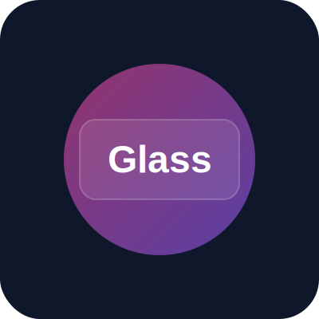

<div align="center">
  

  # Glass Portfolio

  **The ultra-modern, frosted-glass portfolio template for React developers.**

  [](https://opensource.org/licenses/MIT)
  [](https://reactjs.org/)
  [](https://tailwindcss.com/)
  [](https://vitejs.dev/)
  [](http://makeapullrequest.com)

  [Demo](https://bdarbe.github.io/glass-portfolio/) • [Features](#features) • [Installation](#installation) • [Usage](#usage) • [Contributing](#contributing)

</div>

---

## <a id="overview"></a>🔮 Overview

**Glass Portfolio** is a high-performance, visually stunning portfolio template built with React, Vite, and Tailwind CSS. It features a "Glassmorphism" design aesthetic with real-time, fluid background animations and frosted glass cards.

It is designed to be **dropped into any existing project** or used as a standalone personal website.

<div align="center">
  <!-- You would replace this with a real screenshot/GIF later -->
  
</div>

## <a id="features"></a>✨ Features

- **🎨 Glassmorphism UI:** Premium frosted glass effects using backdrop-blur.
- **🚀 Blazing Fast:** Powered by Vite for instant server start.
- **🎭 Smooth Animations:** Integrated `framer-motion` for buttery smooth entry and hover effects.
- **📱 Fully Responsive:** Looks perfect on mobile, tablet, and desktop.
- **🛠 TypeScript Ready:** Built with modern standards in mind.

## <a id="installation"></a>📦 Installation

To get started with this project locally, follow these steps:

```bash
# Clone the repository
git clone https://github.com/bdarbe/glass-portfolio.git

# Navigate into the directory
cd glass-portfolio

# Install dependencies
npm install

# Start the development server
npm run dev
```

## <a id="usage"></a>🚀 Usage

### Customizing the Content

Open `src/App.jsx` to modify the personal information, projects, and social links.

```jsx
// src/App.jsx

<h1 className="...">Your Name</h1>
<p className="...">Your Tagline</p>
```

### Adjusting the Theme

Tailwind configuration can be found in `tailwind.config.js`. You can adjust the animation speeds and colors there.

```javascript
// tailwind.config.js
animation: {
  'blob': 'blob 10s infinite', // Slower animation
}
```

## <a id="contributing"></a>🤝 Contributing

Contributions are what make the open source community such an amazing place to learn, inspire, and create. Any contributions you make are **greatly appreciated**.

1. Fork the Project
2. Create your Feature Branch (`git checkout -b feature/AmazingFeature`)
3. Commit your Changes (`git commit -m 'Add some AmazingFeature'`)
4. Push to the Branch (`git push origin feature/AmazingFeature`)
5. Open a Pull Request

## <a id="license"></a>📄 License

Distributed under the MIT License. See `LICENSE` for more information.

---

<div align="center">
  <p>Built with ❤️ by <a href="https://github.com/bdarbe">bdarbe</a></p>
</div>
